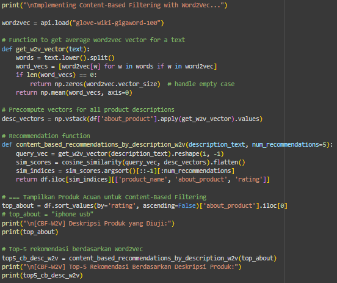
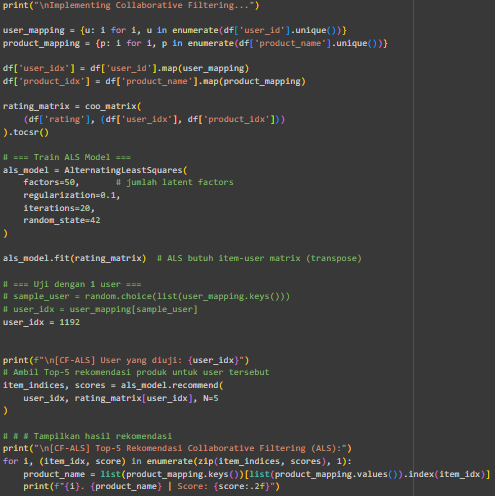

## 📚 Requirements

Proyek ini membutuhkan beberapa library Python.  
Install semua dependency dengan:

```bash
pip install -r requirements.txt
```


# 📦 Product Recommendation System (CBF + CF-ALS)

Proyek ini mengimplementasikan **Sistem Rekomendasi Produk** menggunakan dua pendekatan populer:

1. **Content-Based Filtering (CBF)** dengan **Word2Vec**  
2. **Collaborative Filtering (CF)** dengan **ALS (Alternating Least Squares)**  

Tujuan utama proyek ini adalah memberikan rekomendasi produk berdasarkan:
- **Konten produk** (deskripsi / teks)
- **Perilaku pengguna** (riwayat rating)

---

## 🚀 Fitur Utama

### 1. Content-Based Filtering (CBF)
- Menggunakan pre-trained **Word2Vec (GloVe vectors)** untuk merepresentasikan teks deskripsi produk dalam bentuk vektor numerik.
- Rekomendasi diberikan dengan menghitung **cosine similarity** antara deskripsi produk input dengan seluruh deskripsi produk lain.
- Output: daftar produk dengan deskripsi paling mirip.  

📸 Contoh alur CBF:  


---

### 2. Collaborative Filtering (CF-ALS)
- Dataset diubah menjadi **user–item rating matrix** (sparse).
- Dilatih dengan **Alternating Least Squares (ALS)** untuk mempelajari **latent factors** pengguna dan produk.
- Rekomendasi diberikan dengan menghitung skor prediksi produk yang belum pernah dirating user.  

📸 Contoh alur CF-ALS:  

